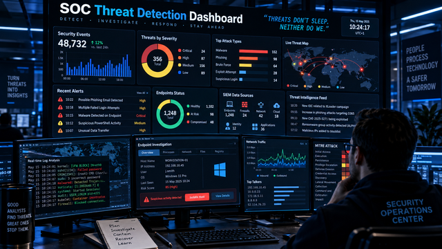
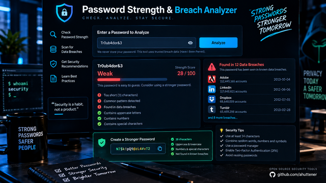
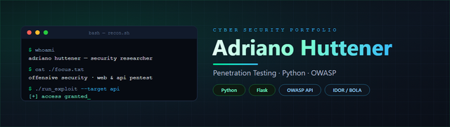
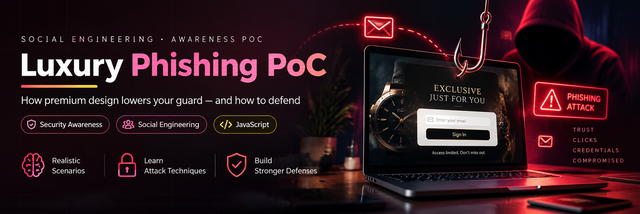
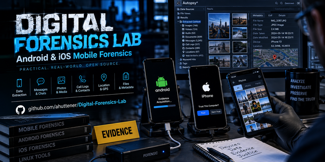
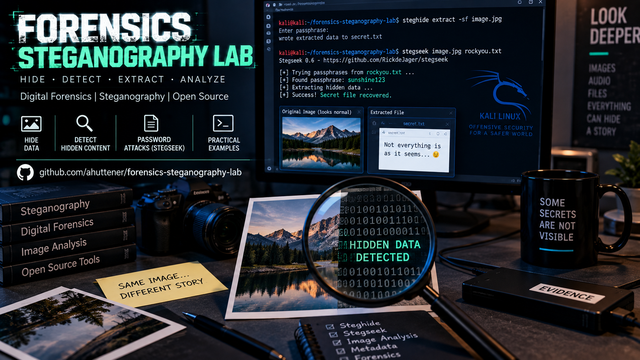

# 👋 Hi, I'm Adriano

`Penetration Tester` `SOC Analyst` `Security-focused Developer`

I'm a security-focused developer moving deeper into **offensive security** and **blue-team operations**. I build and run three products of my own end-to-end — **BRDeals** (marketplace), **Keymate / go2ireland** (room-finding for Ireland, PHP API + mobile app) and **RadarRider** (rider alerts) — and I turn what I learn into hands-on security work: a live **SOC detection dashboard** on Wazuh + MITRE ATT&CK, a privacy-preserving **password-breach checker**, and public labs across penetration testing and digital forensics.

I'm completing an **MSc in Cybersecurity at the National College of Ireland (NCI)**, and I'm open to **Penetration Tester** and **SOC Analyst** roles in Ireland.

## 🎯 Currently focused on

- Completing my **MSc in Cybersecurity** at NCI (Dublin)
- **Detection engineering** — Wazuh, SIEM and MITRE ATT&CK mapping
- **Penetration testing** on web, network and API, documented as reproducible labs

---

## 🛡️ What I work with

The banner above covers the areas I work in: cybersecurity (blue team / red team), cloud security
on AWS and Azure, penetration testing on web, network and API, digital forensics, and SIEM and
monitoring.

## 🧰 What shows up in this account's code

TypeScript and React/Expo in the mobile apps, PHP in the Keymate and BRDeals APIs, Dart/Flutter in
the BRDeals app, Python and Perl in the security labs, Docker and Shell in the marketplace.

---

## 📊 Statistics

<table>
  <tr>
    <td>
      
    </td>
    <td>
      
    </td>
  </tr>
</table>

> These cards only count public repositories. Most of my code lives in private repos, so the
> numbers here sit well below the real volume.

---

## 📌 Public projects

> ⭐ **Featured — [SOC Threat Detection Dashboard](https://github.com/ahuttener/soc-threat-detection-dashboard):** a live blue-team dashboard that scores an event stream against **Wazuh** rules and maps every alert to **MITRE ATT&CK**. Zero-dependency, runs in the browser.

### 🔬 Labs & tools

<table>
  <tr>
    <td width="50%" valign="top">
      
      
<b><a href="https://github.com/ahuttener/soc-threat-detection-dashboard">SOC Threat Detection Dashboard</a></b> Live blue-team detection over Wazuh rules + MITRE ATT&CK

    </td>
    <td width="50%" valign="top">
      
      
<b><a href="https://github.com/ahuttener/password-strength-breach-analyzer">Password Strength &amp; Breach Analyzer</a></b> Strength + HIBP breach check via k-anonymity (client-side)

    </td>
  </tr>
  <tr>
    <td width="50%" valign="top">
      
      
<b><a href="https://github.com/ahuttener/Cyber-Security-Portfolio">Cyber-Security-Portfolio</a></b> Offensive-security lab — API exploitation (IDOR/BOLA) &amp; Python tooling

    </td>
    <td width="50%" valign="top">
      
      
<b><a href="https://github.com/ahuttener/Network-security-policy-audit">Network-security-policy-audit</a></b> Firewall-policy auditor (NIST/CIS) with a CI gate

    </td>
  </tr>
  <tr>
    <td width="50%" valign="top">
      
      
<b><a href="https://github.com/ahuttener/Luxury-Phishing-PoC">Luxury-Phishing-PoC</a></b> Social-engineering awareness PoC — with the defensive breakdown

    </td>
    <td width="50%" valign="top">
      
      
<b><a href="https://github.com/ahuttener/Digital-Forensics-Lab">Digital-Forensics-Lab</a></b> Android &amp; iOS mobile forensics (iLEAPP, Hashcat)

    </td>
  </tr>
  <tr>
    <td width="50%" valign="top">
      
      
<b><a href="https://github.com/ahuttener/forensics-steganography-lab">forensics-steganography-lab</a></b> Steganography — hide &amp; recover data with Steghide/Stegseek

    </td>
    <td width="50%" valign="top"></td>
  </tr>
</table>

---

## 📫 Get in touch

- 💼 LinkedIn — [in/adriano-huttener](https://www.linkedin.com/in/adriano-huttener/)
- 🌐 Website — [cybersecinfo.com](https://cybersecinfo.com)

📍 Kildare, Ireland · open to **Penetration Tester** / **SOC Analyst** roles

🛡️ Building, securing, automating.

