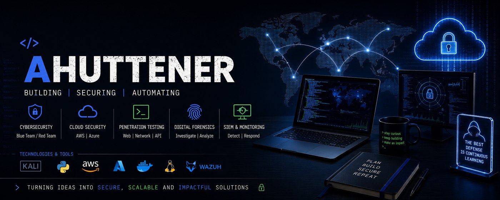

# 👨‍💻 CyberSecInfo

`FullStack Developer` `Offensive Security`

I build and maintain three products of my own, from the backend to the mobile app: **BRDeals**
(marketplace), **Keymate / go2ireland** (room-finding site for Ireland, with a PHP API and a mobile
app) and **RadarRider** (alerts for riders). Alongside that, I keep public labs on offensive
security and digital forensics.

---

## 🛡️ What I work with

The banner above covers the areas I work in: cybersecurity (blue team / red team), cloud security
on AWS and Azure, penetration testing on web, network and API, digital forensics, and SIEM and
monitoring.

## 🧰 What shows up in this account's code

TypeScript and React/Expo in the mobile apps, PHP in the Keymate and BRDeals APIs, Dart/Flutter in
the BRDeals app, Python and Perl in the security labs, Docker and Shell in the marketplace.

---

## 📊 Statistics

<table>
  <tr>
    <td>
      
    </td>
    <td>
      
    </td>
  </tr>
</table>

> These cards only count public repositories. Most of my code lives in private repos, so the
> numbers here sit well below the real volume.

---

## 📌 Public projects

### Products

| Repository | What it is |
| --- | --- |
| [radar-rider](https://github.com/ahuttener/radar-rider) | RadarRider — real-time hazard alerts for riders (Next.js, Prisma, PWA with push) |
| [go2ireland-site](https://github.com/ahuttener/go2ireland-site) | Static site for go2ireland.site (Keymate Ireland) |
| [mykeymate-site](https://github.com/ahuttener/mykeymate-site) | Static site for mykeymate.com (HTML/CSS/JS, no backend) |
| [brdeals_novafase](https://github.com/ahuttener/brdeals_novafase) | BRDeals, new phase |

### Security and forensics

| Repository | What it is |
| --- | --- |
| [Cyber-Security-Portfolio](https://github.com/ahuttener/Cyber-Security-Portfolio) | Offensive security lab: Python scripting and API vulnerability analysis (IDOR) |
| [Network-security-policy-audit](https://github.com/ahuttener/Network-security-policy-audit) | Automated network policy auditing and change management framework for enterprise security compliance |
| [Luxury-Phishing-PoC](https://github.com/ahuttener/Luxury-Phishing-PoC) | Proof of concept on high-ticket phishing, social engineering and local data interception, for educational purposes |
| [Digital-Forensics-Lab](https://github.com/ahuttener/Digital-Forensics-Lab) | Practical exercises on Android and iOS forensics using Linux tools |
| [forensics-steganography-lab](https://github.com/ahuttener/forensics-steganography-lab) | Digital forensics case study: data embedding and password recovery with Steghide and Stegseek |
